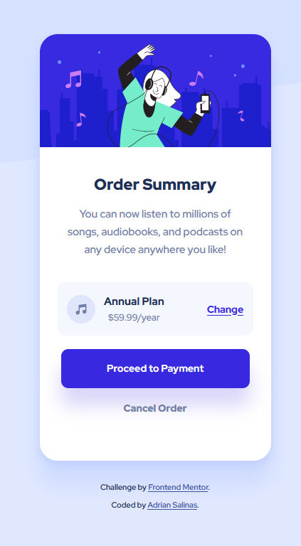
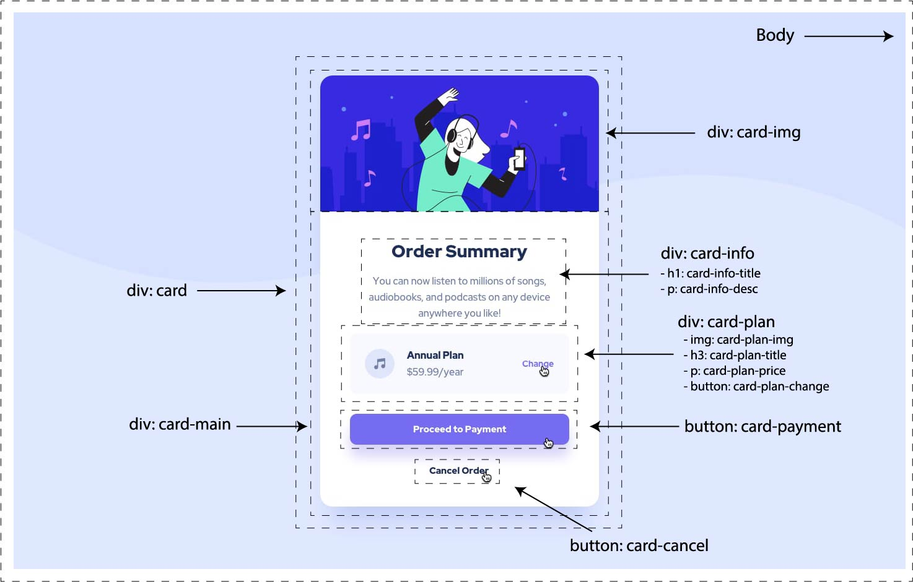

# Frontend Mentor - Order summary card solution

This is a solution to the [Order summary card challenge on Frontend Mentor](https://www.frontendmentor.io/challenges/order-summary-component-QlPmajDUj). Frontend Mentor challenges help you improve your coding skills by building realistic projects. 

## Table of contents

- [Overview](#overview)
  - [The challenge](#the-challenge)
  - [Screenshot](#screenshot)
  - [Links](#links)
- [My process](#my-process)
  - [Built with](#built-with)
  - [What I learned](#what-i-learned)
  - [Continued development](#continued-development)
  - [Useful resources](#useful-resources)
- [Author](#author)

**Note: Delete this note and update the table of contents based on what sections you keep.**

## Overview

### The challenge

Users should be able to:

- See hover states for interactive elements

### Screenshot

### Links

- Solution URL: [Live Site](https://fm-ordrsmrycrd.netlify.app/)
- Live Site URL: [Add live site URL here](https://your-live-site-url.com)

## My process

- Broke down design image by different element and their class names
- Added HTML structure
- Added CSS for desktop
- Added CSS for mobile 

### Built with

- Semantic HTML5 markup
- CSS custom properties
- Flexbox
- Media Queries

### What I learned

- This challenge was on the easier side, but it did allow me to both test my current skills and refine the use of them
- A better understanding on flex box
- A better understanding of media queries for responsive web design

### Continued development

- Understanding best practices and standards when it come to writing code
- Understanding the planning process

### Useful resources

- [W3School - CSS Reference](https://www.w3schools.com/cssref/default.asp) - Used this to reference everything from media queries to CSS syntax

## Author

- Website - [Adrian Salinas](https://www.adriansalinas.tech)
- Frontend Mentor - [@a-dri-an-S](https://www.frontendmentor.io/profile/a-dri-an-S)
